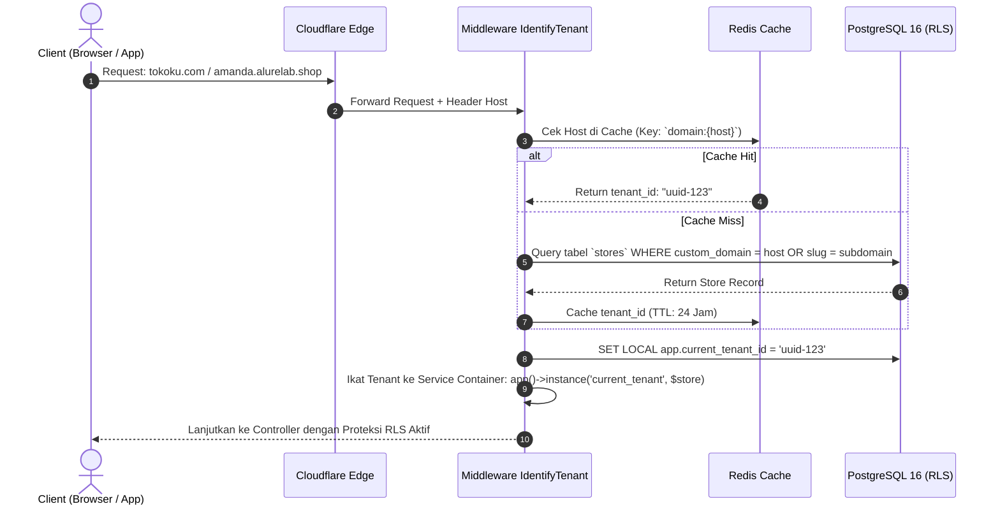
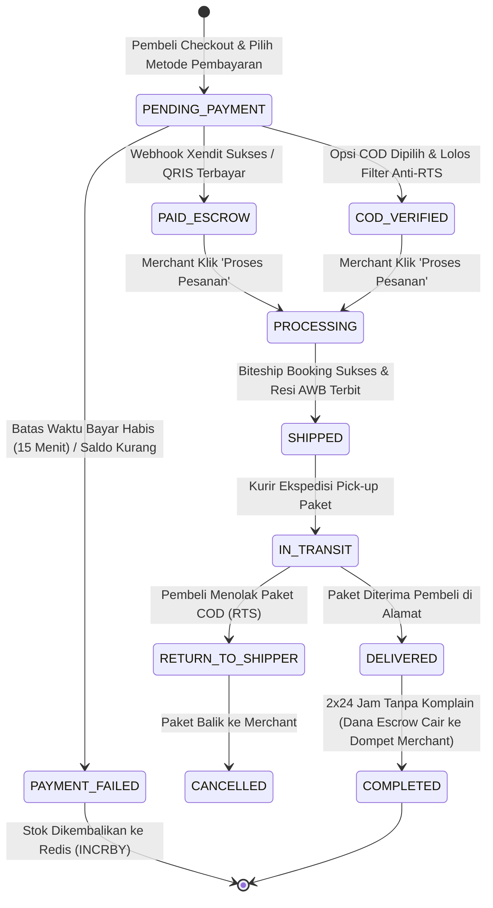

# 🏗️ 02: SYSTEM ARCHITECTURE & DATA FLOW
### *Detail Teknis Arsitektur Multi-Tenant, Routing Domain & Alur Transaksi*

Dokumen ini menguraikan arsitektur internal sistem, pemisahan tenant, mekanisme *Custom Domain*, dan alur lengkap (*state machine*) sejak pembeli mengklik toko hingga dana masuk ke rekening penjual.

---

## 1. Arsitektur Multi-Tenancy (Row-Level Security)

ALURELAB menggunakan model **Shared Database, Shared Schema dengan Row Level Security (RLS)**. Model ini dipilih karena:
- Menghemat biaya server hingga 80% dibanding model *Database-per-Tenant* (tidak perlu ratusan koneksi DB terpisah).
- Jauh lebih aman dibanding sekadar mengandalkan klausa `where('tenant_id', ...)` di Eloquent Laravel yang rentan kelalaian developer (IDOR / data leak).

### Mekanisme Tenant Resolution:
Setiap *HTTP Request* yang masuk ke backend Laravel melalui middleware `IdentifyTenant`:



---

## 2. Arsitektur Custom Domain (Cloudflare for SaaS)

Pedagang dapat menggunakan domain pribadi mereka (contoh: `hijabmevvah.com`) tanpa harus mengerti setting server yang rumit:

1. **Setup Awal di Dashboard ALURELAB**:
   - Merchant memasukkan domain: `hijabmevvah.com`.
   - Backend memanggil API Cloudflare: `POST /zones/{zone_id}/custom_hostnames` dengan hostname `hijabmevvah.com`.
   - Cloudflare merespons dengan 2 record DNS yang harus dipasang merchant:
     - Record CNAME: `hijabmevvah.com` -> `cname.alurelab.shop` (untuk routing traffic).
     - Record TXT: `_cf-custom-hostname.hijabmevvah.com` (untuk validasi kepemilikan domain & penerbitan sertifikat SSL).
2. **Auto-SSL Issuance**:
   - Sistem Cloudflare otomatis memvalidasi TXT record dan menerbitkan sertifikat SSL Let's Encrypt / Google Trust Services dalam waktu 3–5 menit.
3. **Traffic Ingress**:
   - Begitu domain aktif, seluruh traffic ke `hijabmevvah.com` diarahkan ke edge server ALURELAB dengan enkripsi HTTPS penuh secara otomatis.

---

## 3. End-to-End User Flow

### Flow 1: Merchant Onboarding 60 Detik (The Cursor Effect)
1. **Input**: Calon merchant memasukkan username Instagram toko (`@hijab_official`) atau upload 3 foto produk dari kamera HP.
2. **AI Extractor**:
   - Backend memanggil scraper ringan / API untuk mengambil bio, foto profil, dan 6 postingan produk terbaru.
   - OpenAI GPT-4o-mini otomatis membedah caption menjadi: Nama Produk, Harga Taksiran, Kategori, dan Deskripsi Persuasif.
3. **AI Photo Studio**:
   - Foto produk mentah dikirim ke Replicate (model RMBG-2.0) untuk menghapus background kusam.
   - Model Inpainting menempatkan produk pada latar studio profesional (podium kayu, lighting studio hangat, atau bayangan natural).
4. **Instant Store Creation**:
   - Database membuat akun merchant, toko, domain sementara (`hijab-official.alurelab.shop`), dan mengisi katalog produk dalam 1 transaksi atomik.
   - Merchant langsung melihat toko live mereka dalam waktu kurang dari 60 detik.

---

### Flow 2: Siklus Transaksi Pembeli (Checkout & Order Lifecycle)



---

## 4. Mekanisme Kunci Anti-Overselling (Redis Atomic Lock)

Salah satu kegagalan fatal software e-commerce konvensional adalah *race condition*: ketika stok barang tersisa 1, namun ada 5 orang yang menekan tombol bayar pada milidetik yang sama, menyebabkan 5 transaksi berhasil (*overselling*).

ALURELAB menyelesaikan ini di layer Redis In-Memory sebelum menyentuh database relasional:

```php
// Contoh Pseudocode Penanganan Stok Atomik di Controller Checkout
$productId = $request->input('product_id');
$qtyRequested = $request->input('quantity', 1);

$redisStockKey = "store:{$storeId}:stock:{$productId}";

// Eksekusi Atomic Decrement di Redis
$remainingStock = Redis::decrby($redisStockKey, $qtyRequested);

if ($remainingStock < 0) {
    // Stok tidak mencukupi, kembalikan nilai stok segera
    Redis::incrby($redisStockKey, $qtyRequested);
    
    return response()->json([
        'success' => false,
        'message' => 'Maaf, produk ini baru saja habis dibeli pelanggan lain!'
    ], 409);
}

// Jika stok berhasil dikunci, buat tagihan pembayaran dengan TTL 15 menit
$order = Order::create([...]);

// Dispatch Delayed Job: Jika dalam 15 menit belum dibayar, kembalikan stok
ReleaseUnpaidStockJob::dispatch($order->id)->delay(now()->addMinutes(15));
```
